# 🛒 Baskito – Smart Dish-Based Grocery Ordering

**Order your grocery in just three clicks – Select Dish → SmartCart → Payment.**

Baskito is not just another grocery website — it’s a **fast, smart, and user-friendly grocery ordering platform**.  
Instead of searching for each item one by one, simply **search for a dish**, and Baskito will automatically display and add all the required ingredients to your cart with **one click** using our unique **SmartCart** feature.

And we’ve taken it a step further — with **warehouse integration** and **Google Maps live tracking**, you can see where your groceries are coming from and exactly how long they’ll take to arrive.

---

## 🚀 Features

- **SmartCart Functionality** – Automatically add all ingredients for a selected dish in a single click.
- **Dish-to-Ingredients Mapping** – Instantly view all required ingredients for any dish.
- **Flexible Cart Management** – Add items individually or in bulk via SmartCart.
- **Secure User Authentication** – Sign up/login with personalized carts.
- **Integrated Payment Gateway** – Smooth online checkout process.
- **Warehouse Integration** – Displays estimated delivery time based on the nearest warehouse location.
- **Interactive Map** – Shows warehouse location, delivery route, and your location in real time.
- **Responsive Design** – Works perfectly on mobile, tablet, and desktop devices.

---

## 💡 USP – Unique Selling Proposition

> **Baskito reduces grocery ordering time by up to 80%** with a simple 3-click process:
> **1. Select Dish → 2. SmartCart → 3. Payment**

---

## 🌟 Impact

- Cut grocery ordering time by **80%** through automated SmartCart.
- Enhanced delivery transparency with live warehouse-to-customer route tracking.
- Improved customer trust and convenience through ETA display and map integration.

---

## 🛠️ Tech Stack

- **Frontend:** HTML, CSS, JavaScript, EJS
- **Backend:** Node.js, Express.js
- **Database:** MongoDB
- **Authentication:** Secure user login/signup system
- **Payment:** Integrated Payment Gateway API
- **Maps & Location:** Google Maps API for live location tracking and route display

---

## ⚡ How It Works

1. **Select a Dish** – Search or choose from our dish list.  
2. **Click SmartCart** – All related ingredients are instantly added to your cart.  
3. **Make Payment** – Checkout securely via the integrated payment gateway.  
4. **Track Your Order** – See warehouse location, route, and ETA on a live map.

---

## 📸 Screenshots

**Homepage**  
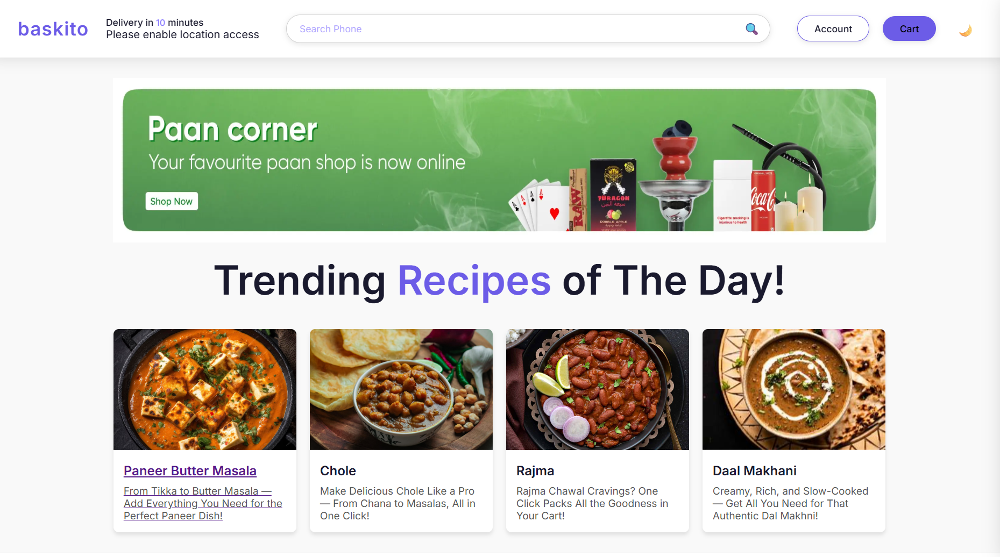

**Login Page**
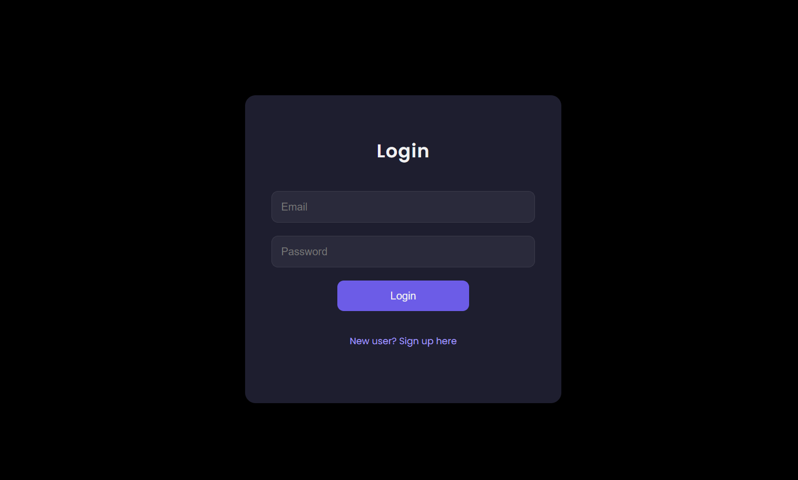

**Signup Page**
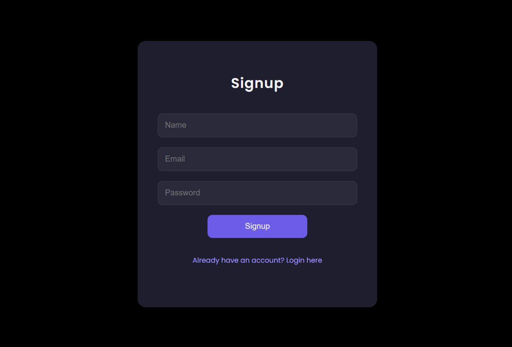

**Dish Search**  


**Dish Selection Page 1**
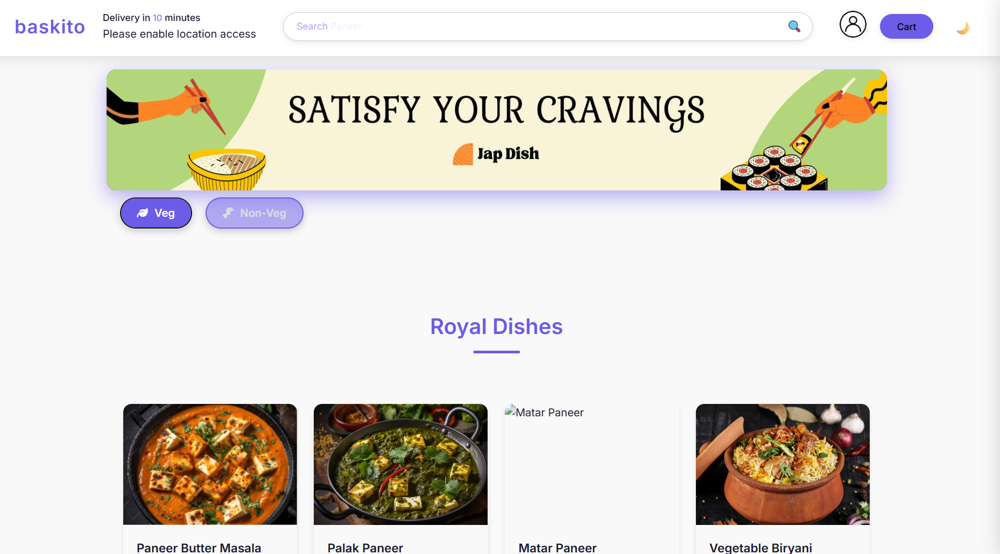

**Dish Selection Page 2**
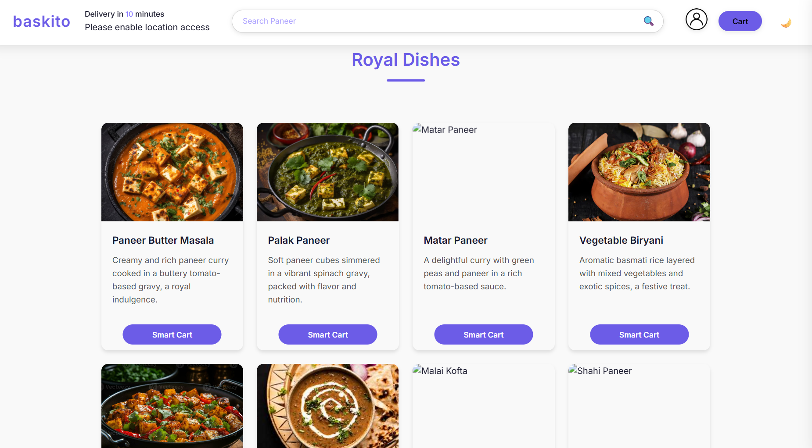

**Dish Page**
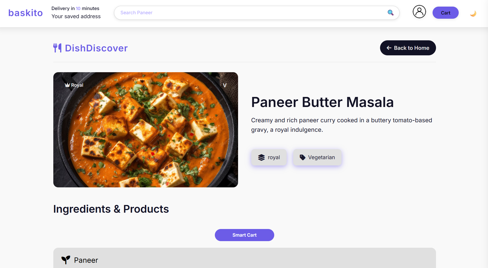

**Cart Page**
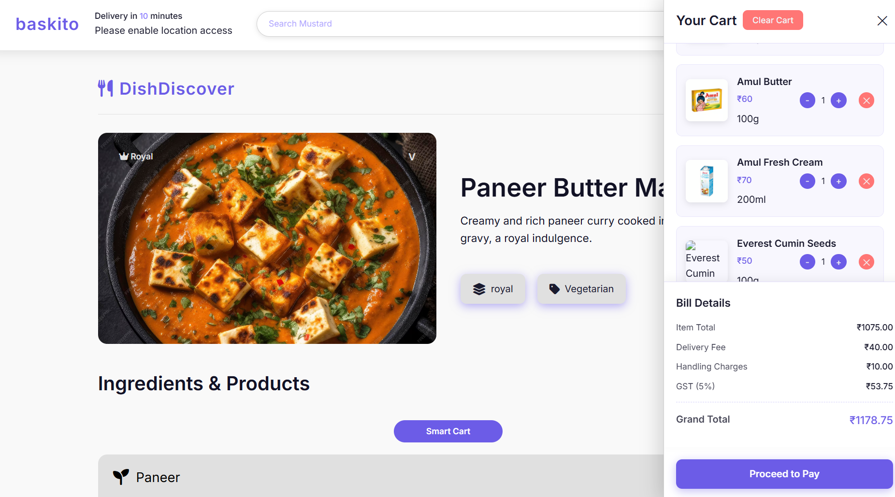

**Payment Gateway Page**
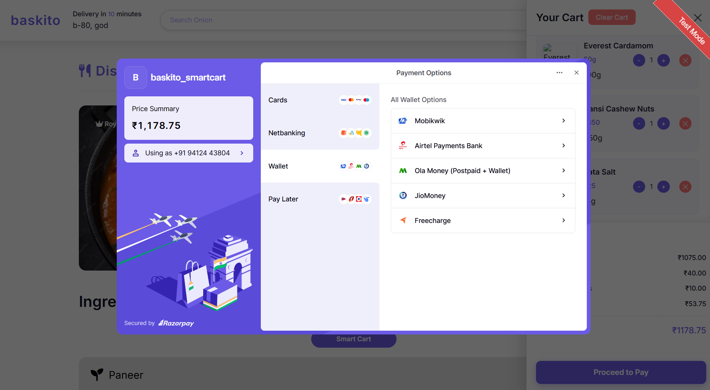

**Live Tracking Map 1**
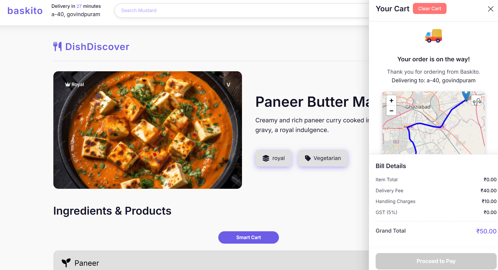

**Live Tracking Map 2**


**Your Orders History Page 1**  


**Your Orders History Page 2**  
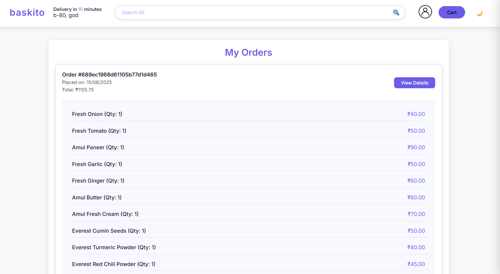

**Logout Page**  
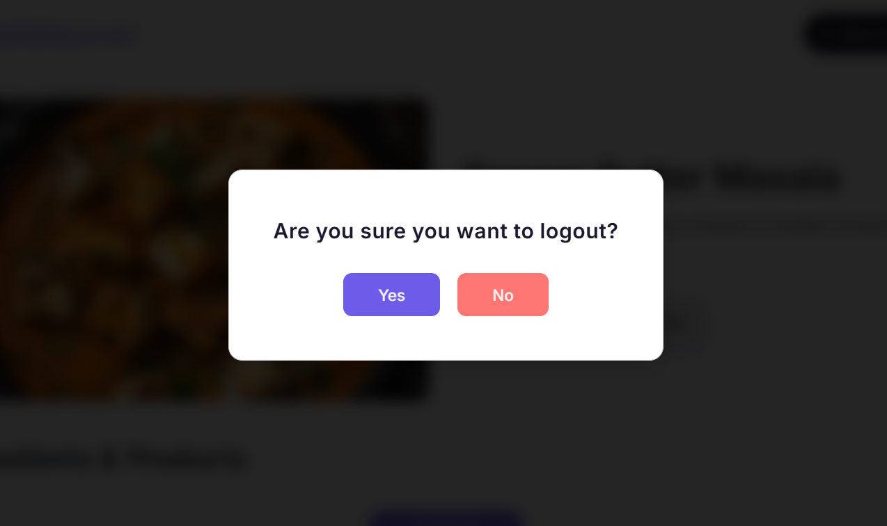


---

## 🎥 Demo Video

[▶ Watch Demo on YouTube](https://youtu.be/your-demo-video-link)

---

## 📂 Installation & Setup

```bash
# 1️⃣ Clone the repository
git clone https://github.com/yadav-yashvardhan/Baskito-Grocery-Project.git

# 2️⃣ Install dependencies
npm install

# 3️⃣ Seed the database (populate with sample dishes & ingredients)
node seed.js

# 4️⃣ Start the server
node app.js
